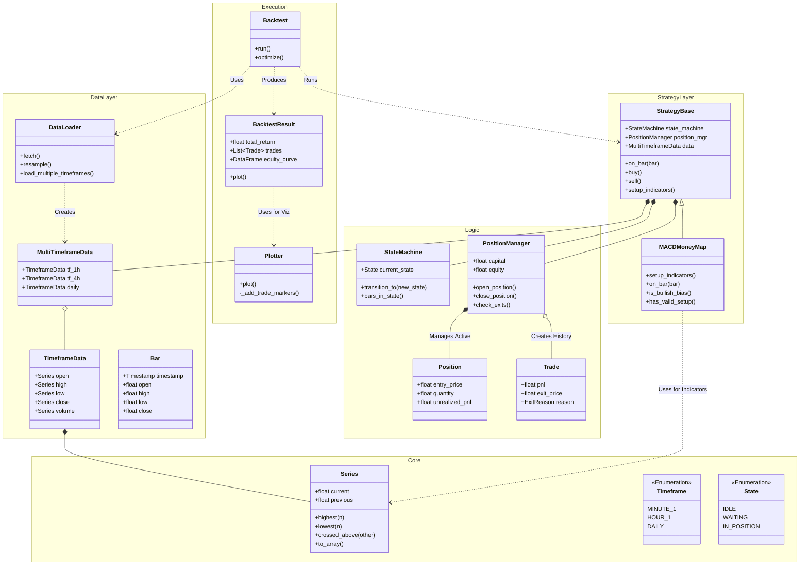

```mermaid
classDiagram
    %% ---------------------------------------------------------
    %% CORE TYPES & DATA STRUCTURES
    %% ---------------------------------------------------------
    namespace Core {
        class Series {
            +float current
            +float previous
            +highest(n)
            +lowest(n)
            +crossed_above(other)
            +to_array()
        }
        class Timeframe {
            <<Enumeration>>
            MINUTE_1
            HOUR_1
            DAILY
        }
        class State {
            <<Enumeration>>
            IDLE
            WAITING
            IN_POSITION
        }
    }

    %% ---------------------------------------------------------
    %% DATA LAYER
    %% ---------------------------------------------------------
    namespace DataLayer {
        class DataLoader {
            +fetch()
            +resample()
            +load_multiple_timeframes()
        }
        class TimeframeData {
            +Series open
            +Series high
            +Series low
            +Series close
            +Series volume
        }
        class MultiTimeframeData {
            +TimeframeData tf_1h
            +TimeframeData tf_4h
            +TimeframeData daily
        }
        class Bar {
            +Timestamp timestamp
            +float open
            +float high
            +float low
            +float close
        }
    }

    %% ---------------------------------------------------------
    %% TRADING LOGIC & STATE
    %% ---------------------------------------------------------
    namespace Logic {
        class StateMachine {
            +State current_state
            +transition_to(new_state)
            +bars_in_state()
        }
        class PositionManager {
            +float capital
            +float equity
            +open_position()
            +close_position()
            +check_exits()
        }
        class Position {
            +float entry_price
            +float quantity
            +float unrealized_pnl
        }
        class Trade {
            +float pnl
            +float exit_price
            +ExitReason reason
        }
    }

    %% ---------------------------------------------------------
    %% STRATEGY LAYER
    %% ---------------------------------------------------------
    namespace StrategyLayer {
        class StrategyBase {
            +StateMachine state_machine
            +PositionManager position_mgr
            +MultiTimeframeData data
            +on_bar(bar)
            +buy()
            +sell()
            +setup_indicators()
        }
        
        class MACDMoneyMap {
            +setup_indicators()
            +on_bar(bar)
            +is_bullish_bias()
            +has_valid_setup()
        }
    }

    %% ---------------------------------------------------------
    %% EXECUTION & VISUALIZATION
    %% ---------------------------------------------------------
    namespace Execution {
        class Backtest {
            +run()
            +optimize()
        }
        class BacktestResult {
            +float total_return
            +List~Trade~ trades
            +DataFrame equity_curve
            +plot()
        }
        class Plotter {
            +plot()
            -_add_trade_markers()
        }
    }

    %% ---------------------------------------------------------
    %% RELATIONSHIPS
    %% ---------------------------------------------------------
    
    %% Inheritance
    StrategyBase <|-- MACDMoneyMap

    %% Composition (Strategy owns these)
    StrategyBase *-- StateMachine
    StrategyBase *-- PositionManager
    StrategyBase *-- MultiTimeframeData

    %% Data Relationships
    MultiTimeframeData o-- TimeframeData
    TimeframeData *-- Series
    DataLoader ..> MultiTimeframeData : Creates

    %% Trading Relationships
    PositionManager *-- Position : Manages Active
    PositionManager o-- Trade : Creates History

    %% Execution Flow
    Backtest ..> DataLoader : Uses
    Backtest ..> StrategyBase : Runs
    Backtest ..> BacktestResult : Produces
    BacktestResult ..> Plotter : Uses for Viz
    
    %% Indicator Usage
    MACDMoneyMap ..> Series : Uses for Indicators

```
