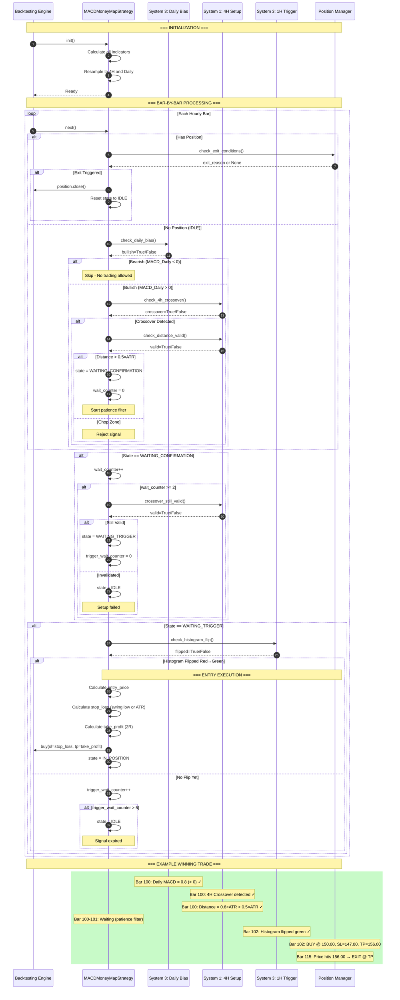

```mermaid
sequenceDiagram
    autonumber
    participant BT as Backtesting Engine
    participant S as MACDMoneyMapStrategy
    participant S3D as System 3: Daily Bias
    participant S1 as System 1: 4H Setup
    participant S3T as System 3: 1H Trigger
    participant PM as Position Manager
    
    Note over BT,PM: === INITIALIZATION ===
    
    BT->>S: init()
    S->>S: Calculate all indicators
    S->>S: Resample to 4H and Daily
    S-->>BT: Ready
    
    Note over BT,PM: === BAR-BY-BAR PROCESSING ===
    
    loop Each Hourly Bar
        BT->>S: next()
        
        alt Has Position
            S->>PM: check_exit_conditions()
            PM-->>S: exit_reason or None
            
            alt Exit Triggered
                S->>BT: position.close()
                S->>S: Reset state to IDLE
            end
        else No Position (IDLE)
            S->>S3D: check_daily_bias()
            S3D-->>S: bullish=True/False
            
            alt Bearish (MACD_Daily ≤ 0)
                Note over S: Skip - No trading allowed
            else Bullish (MACD_Daily > 0)
                S->>S1: check_4h_crossover()
                S1-->>S: crossover=True/False
                
                alt Crossover Detected
                    S->>S1: check_distance_valid()
                    S1-->>S: valid=True/False
                    
                    alt Distance > 0.5×ATR
                        S->>S: state = WAITING_CONFIRMATION
                        S->>S: wait_counter = 0
                        Note over S: Start patience filter
                    else Chop Zone
                        Note over S: Reject signal
                    end
                end
            end
        end
        
        alt State == WAITING_CONFIRMATION
            S->>S: wait_counter++
            
            alt wait_counter >= 2
                S->>S1: crossover_still_valid()
                S1-->>S: valid=True/False
                
                alt Still Valid
                    S->>S: state = WAITING_TRIGGER
                    S->>S: trigger_wait_counter = 0
                else Invalidated
                    S->>S: state = IDLE
                    Note over S: Setup failed
                end
            end
        end
        
        alt State == WAITING_TRIGGER
            S->>S3T: check_histogram_flip()
            S3T-->>S: flipped=True/False
            
            alt Histogram Flipped Red→Green
                Note over S,PM: === ENTRY EXECUTION ===
                S->>S: Calculate entry_price
                S->>S: Calculate stop_loss (swing low or ATR)
                S->>S: Calculate take_profit (2R)
                S->>BT: buy(sl=stop_loss, tp=take_profit)
                S->>S: state = IN_POSITION
            else No Flip Yet
                S->>S: trigger_wait_counter++
                
                alt trigger_wait_counter > 5
                    S->>S: state = IDLE
                    Note over S: Signal expired
                end
            end
        end
    end
    
    Note over BT,PM: === EXAMPLE WINNING TRADE ===
    
    rect rgb(200, 250, 200)
        Note over S3D: Bar 100: Daily MACD = 0.8 (> 0) ✓
        Note over S1: Bar 100: 4H Crossover detected ✓
        Note over S1: Bar 100: Distance = 0.6×ATR > 0.5×ATR ✓
        Note over S: Bar 100-101: Waiting (patience filter)
        Note over S3T: Bar 102: Histogram flipped green ✓
        Note over PM: Bar 102: BUY @ 150.00, SL=147.00, TP=156.00
        Note over PM: Bar 115: Price hits 156.00 → EXIT @ TP
    end
```