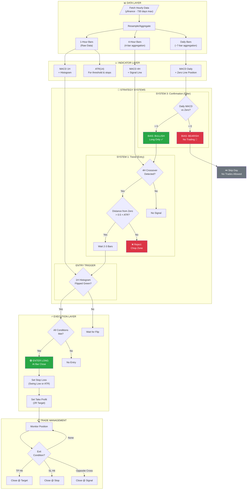

#  MACD Money Map Strategy 

## The Three Systems Overview

| System | Name | Purpose | When to Use |
|--------|------|---------|-------------|
| **System 1** | Trend System | Catch big moves that run for days/weeks | Trending markets |
| **System 2** | Reversal System | Catch major turning points | Before reversals |
| **System 3** | Confirmation System | Filter bad trades | Always (validates System 1 & 2) |

---

## SYSTEM 1: THE TREND SYSTEM

### Part A: Zero Line Foundation (The Law)

**Rule: The Zero Line is ABSOLUTE LAW**

| MACD Position | Action |
|---------------|--------|
| **Above Zero** | ONLY look for BUYS - no exceptions |

> *"Stop fighting what the market is literally showing you"*

### Part B: The Crossover Entry

**Problem:** 80% of crossovers happen in the "chop zone" near zero = losing trades

**Solution: The Distance Rule**

- Only take crossovers that happen **FAR from zero line**
- Threshold: Above +0.5 or below -0.5 (this proves trend has power)

**The Waiting Rule:**
- Wait **2-3 candles AFTER the crossover** before entering
- This eliminates ~50% of false signals
- Market needs time to prove the crossover is real

**Valid Trend Entry:**
```
MACD above zero + Bullish crossover above +0.5 line + Wait 2-3 candles = BUY
MACD below zero + Bearish crossover below -0.5 line + Wait 2-3 candles = SELL
```

---

## SYSTEM 2: THE REVERSAL SYSTEM

### Part A: Divergence Detection

**Bearish Divergence (Top Forming):**
- Price makes **HIGHER HIGH**
- MACD makes **LOWER HIGH**
- = Reversal coming, prepare to sell

**Bullish Divergence (Bottom Forming):**
- Price makes **LOWER LOW**
- MACD makes **HIGHER LOW**
- = Reversal coming, prepare to buy

> *"The engine is dying while the car is still moving forward"*

**CRITICAL:** Divergence alone is NOT enough! You need histogram confirmation.

### Part B: Histogram Confirmation (3 Patterns)

| Pattern | Description | Meaning |
|---------|-------------|---------|
| **The Flip** | First green bar after multiple red bars (or vice versa) | Momentum shifting - ENTRY TRIGGER |
| **The Shrinking Tower** | Bars getting progressively smaller | Move running out of gas - WARNING |
| **The Zero Bounce** | Histogram approaches zero then bounces away | Trend still has power - CONTINUATION |

**Reversal Trade Formula:**
```
Divergence (Alert) + Histogram Flip (Trigger) = REVERSAL TRADE ENTRY
```

---

## SYSTEM 3: THE CONFIRMATION SYSTEM

### Part A: Triple Timeframe Stack

**The Rule:** All three timeframes MUST agree before taking ANY trade

| Timeframe | Role | What to Check |
|-----------|------|---------------|
| **DAILY** | Bias/Trend | Which side of zero? → Determines ONLY BUYS or ONLY SELLS |
| **4-HOUR** | Setup/Signal | Crossover (System 1) or Divergence (System 2) forming? |
| **1-HOUR** | Entry Trigger | Histogram flip confirmation? |

**Timeframe Selection Rule (4x Multiplier):**
- Trading 15-min → Check 1-hour and 4-hour
- Trading 1-hour → Check 4-hour and Daily
- Trading 4-hour → Check Daily and Weekly

**Conflict Rules:**
- Daily bullish BUT 4-hour bearish → **PASS**
- 4-hour has signal BUT 1-hour doesn't confirm → **WAIT**

### Part B: Price Action Confirmation

Additional filters for A+ setups:
- Crossover at major support/resistance = higher win rate
- Divergence + candlestick pattern (hammer, etc.) at key level = best setup
- Trendline break + MACD crossover AFTER break = valid entry

---

## THE COMPLETE ALGORITHM (No Code)

### STEP 1: DAILY SCAN - Establish Bias (5 seconds)

```
CHECK: Daily MACD position relative to zero line

IF Daily MACD > 0:
    BIAS = BULLISH (only look for BUYS today)
    
IF Daily MACD < 0:
    BIAS = BEARISH (only look for SELLS today)
```

### STEP 2: FIND SETUP ON 4-HOUR CHART

```
SCAN FOR SYSTEM 1 (Trend):
    - Is there a crossover FAR from zero? (above +0.5 or below -0.5)
    - Does crossover direction match Daily bias?
    
SCAN FOR SYSTEM 2 (Reversal):
    - Is there divergence forming?
    - Price vs MACD disagreement?
    
IF setup found AND matches Daily bias:
    PROCEED to Step 3
ELSE:
    NO TRADE TODAY
```

### STEP 3: CONFIRM ON 1-HOUR CHART

```
CHECK HISTOGRAM:
    - Has histogram flipped color? (red→green for buy, green→red for sell)
    
CHECK PRICE ACTION (optional but improves win rate):
    - Is price at support/resistance?
    - Any confirming candlestick patterns?

IF histogram confirms AND price action supports:
    VALID ENTRY SIGNAL
ELSE:
    WAIT (do not enter yet)
```

### STEP 4: ENTRY EXECUTION

```
ENTRY TIMING:
    - Enter at candle CLOSE, never mid-candle
    - For trend trades: wait 2-3 candles after crossover
    
STOP LOSS:
    - Place at recent swing high (for shorts)
    - Place at recent swing low (for longs)
    - Alternative: Use ATR-based stop
    
TAKE PROFIT:
    - Target = 2x Risk (2R)
```

### STEP 5: TRADE MANAGEMENT

```
WHEN price hits target (2R):
    - Close 50% of position
    - Move stop loss to breakeven on remaining 50%
    
TRAILING EXIT:
    - Trail remaining position
    - Exit on opposite MACD crossover
```

---

## COMPLETE DECISION FLOWCHART

```
┌─────────────────────────────────────────────────────────────┐
│                    START: Daily Chart                        │
│                    Check MACD vs Zero                        │
└─────────────────────────┬───────────────────────────────────┘
                          │
            ┌─────────────┴─────────────┐
            │                           │
     MACD > 0                    MACD < 0
     BIAS: LONG ONLY             BIAS: SHORT ONLY
            │                           │
            └─────────────┬─────────────┘
                          │
                          ▼
┌─────────────────────────────────────────────────────────────┐
│                  4-HOUR CHART: Find Setup                    │
├─────────────────────────┬───────────────────────────────────┤
│   SYSTEM 1: TREND       │      SYSTEM 2: REVERSAL           │
│   Crossover far from 0  │      Divergence forming           │
│   (above +0.5/-0.5)     │      (Price vs MACD disagree)     │
└─────────────────────────┴───────────────────────────────────┘
                          │
                          ▼
                 Setup matches bias?
                    /          \
                  NO            YES
                  │              │
               NO TRADE          │
                                 ▼
┌─────────────────────────────────────────────────────────────┐
│                1-HOUR CHART: Confirm Entry                   │
│                                                              │
│    □ Histogram flipped color?                               │
│    □ Price at key level? (optional)                         │
│    □ Candlestick confirmation? (optional)                   │
└─────────────────────────────────────────────────────────────┘
                          │
                          ▼
              All confirmations met?
                    /          \
                  NO            YES
                  │              │
                WAIT        ┌────┴────┐
                            │  ENTER  │
                            │ At close│
                            └────┬────┘
                                 │
                                 ▼
┌─────────────────────────────────────────────────────────────┐
│                    TRADE MANAGEMENT                          │
│                                                              │
│  • Stop: Recent swing high/low (or ATR-based)               │
│  • Target: 2x Risk                                          │
│  • At target: Close 50%, move stop to breakeven             │
│  • Trail rest with opposite MACD cross                      │
└─────────────────────────────────────────────────────────────┘
```

---

## Questions Before I Code This

Now I understand the full strategy. Before implementation, I need to confirm:

### 1. **Data Granularity**
To implement true multi-timeframe (Daily/4H/1H), I need to fetch **hourly intraday data**. yfinance provides this but only for the last 730 days. Is this acceptable?

### 2. **Long-Only Confirmation**
You said Long-Only. So even if Daily MACD < 0, we simply **don't trade** (rather than shorting)?

### 3. **Which Systems to Implement?**

| System | Implement? |
|--------|------------|
| System 1 (Trend - Crossover far from zero) | Yes? |
| System 2 (Reversal - Divergence + Histogram flip) | Yes? |
| System 3 (Multi-timeframe confirmation) | Yes? |

Or do you want them as **separate selectable strategies** in your app?

### 4. **The +0.5 Threshold**
The document uses 0.5 as example. This may not work for all stocks (a $500 stock vs $5 stock). Options:
- **Fixed value** (0.5)
- **Percentage of price** (e.g., 0.1% of stock price)
- **ATR-based** (e.g., 0.5 × ATR)
- **Percentile-based** (e.g., top 25% of MACD readings)

Which approach?

### 5. **"Wait 2-3 Candles" Rule**
Implement this? It means after crossover detection, wait 2-3 bars before entering.

### 6. **Divergence Detection**
This is complex to code. Do you want me to implement automatic divergence detection, or skip System 2 for now and focus on System 1 + System 3?
---

Please answer these questions so I can implement the strategy correctly rather than guessing!


