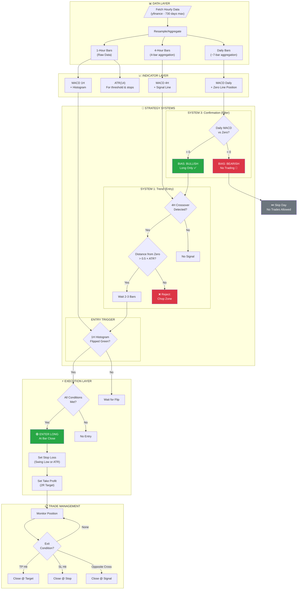

```mermaid
flowchart TB
    subgraph DATA["📊 DATA LAYER"]
        FETCH[/"Fetch Hourly Data<br/>(yfinance - 730 days max)"/]
        RESAMPLE["Resample/Aggregate"]
        
        FETCH --> RESAMPLE
        
        RESAMPLE --> H1["1-Hour Bars<br/>(Raw Data)"]
        RESAMPLE --> H4["4-Hour Bars<br/>(4-bar aggregation)"]
        RESAMPLE --> D1["Daily Bars<br/>(~7-bar aggregation)"]
    end
    
    subgraph INDICATORS["📈 INDICATOR LAYER"]
        H1 --> MACD_1H["MACD 1H<br/>+ Histogram"]
        H4 --> MACD_4H["MACD 4H<br/>+ Signal Line"]
        D1 --> MACD_D["MACD Daily<br/>+ Zero Line Position"]
        
        H1 --> ATR["ATR(14)<br/>For threshold & stops"]
    end
    
    subgraph SYSTEMS["🎯 STRATEGY SYSTEMS"]
        subgraph SYS3["SYSTEM 3: Confirmation (Filter)"]
            MACD_D --> BIAS{"Daily MACD<br/>vs Zero?"}
            BIAS -->|"> 0"| BULL["BIAS: BULLISH<br/>Long Only ✅"]
            BIAS -->|"< 0"| BEAR["BIAS: BEARISH<br/>No Trading 🚫"]
        end
        
        subgraph SYS1["SYSTEM 1: Trend (Entry)"]
            MACD_4H --> CROSS{"4H Crossover<br/>Detected?"}
            CROSS -->|"Yes"| DIST{"Distance from Zero<br/>> 0.5 × ATR?"}
            DIST -->|"Yes"| WAIT["Wait 2-3 Bars"]
            DIST -->|"No"| REJECT1["❌ Reject:<br/>Chop Zone"]
            CROSS -->|"No"| NOSIG["No Signal"]
        end
        
        subgraph TRIGGER["ENTRY TRIGGER"]
            MACD_1H --> FLIP{"1H Histogram<br/>Flipped Green?"}
        end
    end
    
    subgraph EXECUTION["⚡ EXECUTION LAYER"]
        BULL --> CROSS
        WAIT --> FLIP
        FLIP -->|"Yes"| VALIDATE{"All Conditions<br/>Met?"}
        FLIP -->|"No"| WAITING["Wait for Flip"]
        
        VALIDATE -->|"Yes"| ENTRY["🟢 ENTER LONG<br/>At Bar Close"]
        VALIDATE -->|"No"| NOENTRY["No Entry"]
        
        ENTRY --> STOPS["Set Stop Loss<br/>(Swing Low or ATR)"]
        STOPS --> TARGET["Set Take Profit<br/>(2R Target)"]
    end
    
    subgraph MANAGEMENT["📋 TRADE MANAGEMENT"]
        TARGET --> MONITOR["Monitor Position"]
        MONITOR --> EXIT_CHECK{"Exit<br/>Condition?"}
        EXIT_CHECK -->|"TP Hit"| CLOSE_TP["Close @ Target"]
        EXIT_CHECK -->|"SL Hit"| CLOSE_SL["Close @ Stop"]
        EXIT_CHECK -->|"Opposite Cross"| CLOSE_TRAIL["Close @ Signal"]
        EXIT_CHECK -->|"None"| MONITOR
    end
    
    BEAR --> SKIP["⏭️ Skip Day<br/>No Trades Allowed"]
    
    style BULL fill:#28a745,color:#fff
    style BEAR fill:#dc3545,color:#fff
    style ENTRY fill:#28a745,color:#fff
    style REJECT1 fill:#dc3545,color:#fff
    style SKIP fill:#6c757d,color:#fff
```
